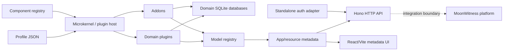

# MW Edge system overview

MW Edge is a local-first, plugin-driven TypeScript business data engine. Its microkernel composes domain plugins and addons from a profile, materializes models into domain-isolated SQLite databases, exposes runtime metadata and HTTP APIs, and powers a metadata-driven React UI.

## System map

The dashed MoonWitness edge is an integration boundary, not a bundled implementation. This repository includes a standalone adapter so MW Edge can run locally without canonical MoonWitness identity state.

## Ownership boundaries

### Microkernel

The microkernel owns mechanisms, not business models. It validates component manifests, resolves profile dependencies, verifies the plugin lock, builds the model registry, materializes schema, runs seeds, builds metadata, and manages lifecycle state. See [the plugin host](../../src/kernel/plugins/host.ts).

### Domain plugins

A domain plugin owns one business domain and its logical database. The current component catalog is defined in [the registry](../../src/kernel/plugins/registry.ts). Domain models live below [`plugins/`](../../plugins/), not in the kernel.

### Addons

An addon extends a target domain plugin and shares the target domain database rather than creating an unrelated database. Addons live below [`addons/`](../../addons/) and are composed through the same profile resolver.

### Profiles

Profiles are declarative component sets under [`profiles/`](../../profiles/). A profile selects which plugins and addons become active for a boot. The kernel-only profile contains no business components; standalone profiles add the local standalone adapter.

## Data boundaries

The [domain database router](../../src/kernel/database/router.ts) maps each active domain to its own SQLite database file when running on disk.

MW Edge model fields distinguish cross-domain references from same-domain relational structure:

- `Reference` is the cross-domain identifier mechanism.
- `Relation` is reserved for relationships that stay inside one domain database.

This boundary prevents the architecture from depending on cross-database SQL joins. The field contract is defined in [kernel types](../../src/kernel/types.ts).

## Metadata UI and API

The [metadata builder](../../src/kernel/metadata.ts) derives resource labels, navigation groups, CRUD capabilities, fields, list columns, and form sections from registered models. The [HTTP app](../../src/http/app.ts) exposes health, bootstrap/auth endpoints, metadata, and guarded admin resource routes. The React/Vite UI consumes this metadata instead of hard-coding a separate resource schema.

## Standalone and MoonWitness boundaries

Standalone mode provides a local principal/session adapter for development and independent deployments. It is not canonical MoonWitness identity state. When MW Edge is integrated behind MoonWitness identity/security, the standalone adapter is an integration substitute, not the source of platform identity truth.

Current repository behavior is local SQLite plus standalone HTTP/UI. Cloud database adapters, plugin marketplaces, WASM isolation, and remote supply-chain verification remain roadmap work and must not be described as shipped.
